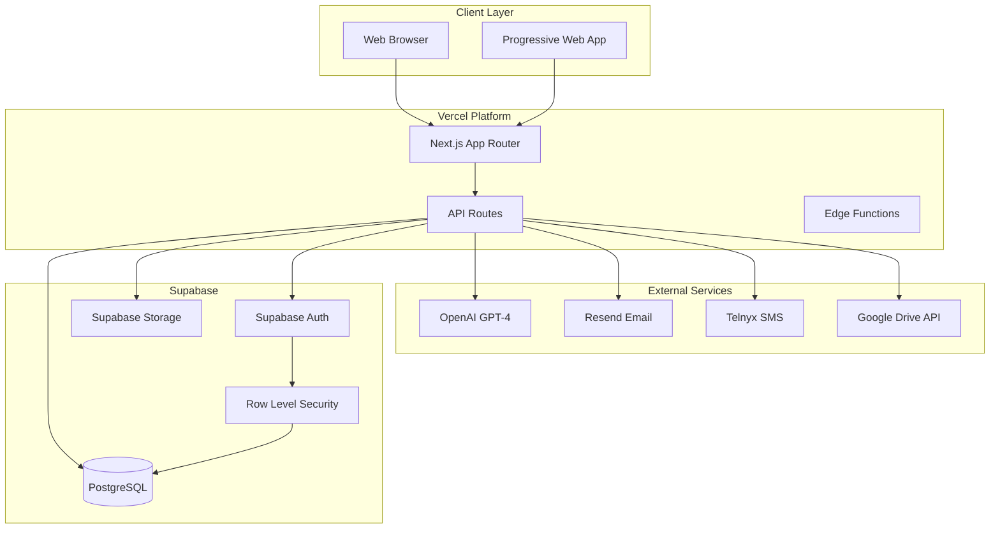
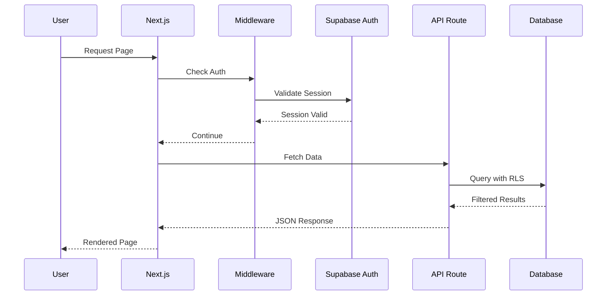
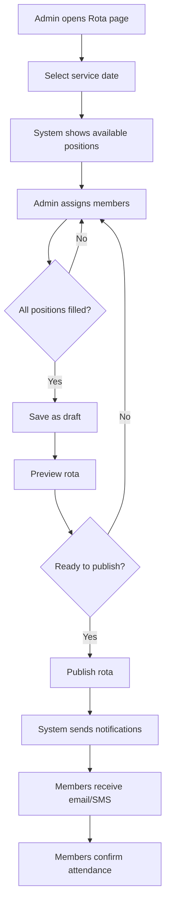
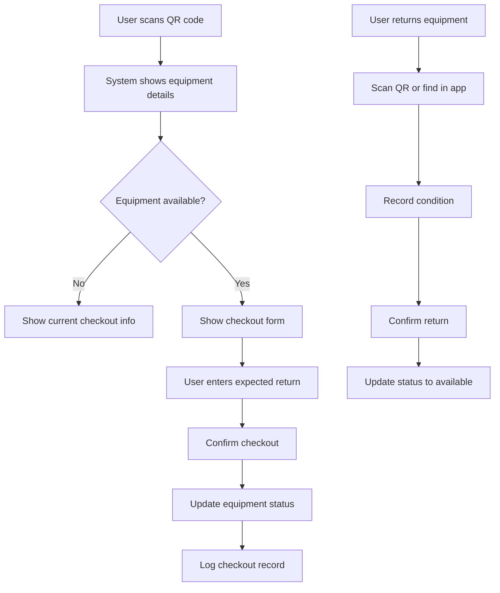
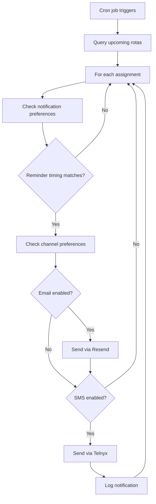
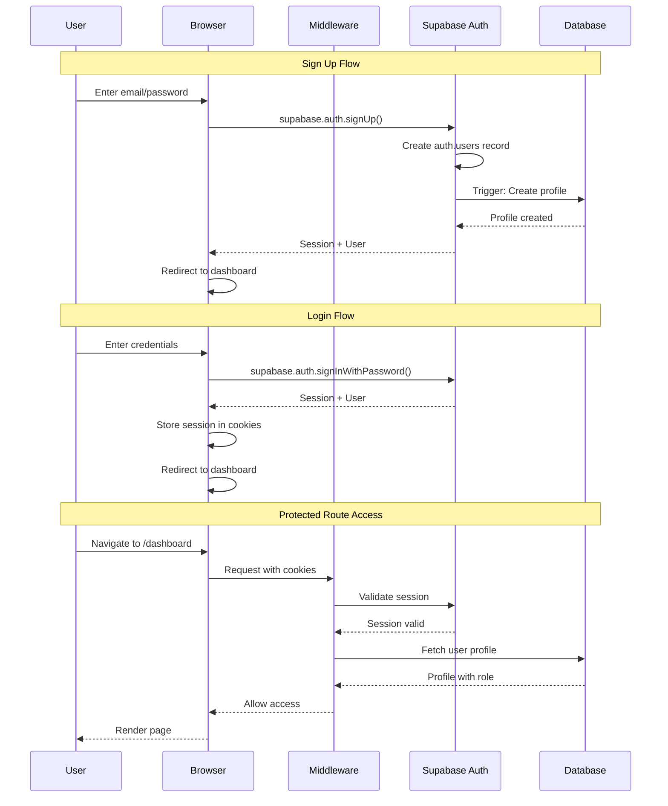
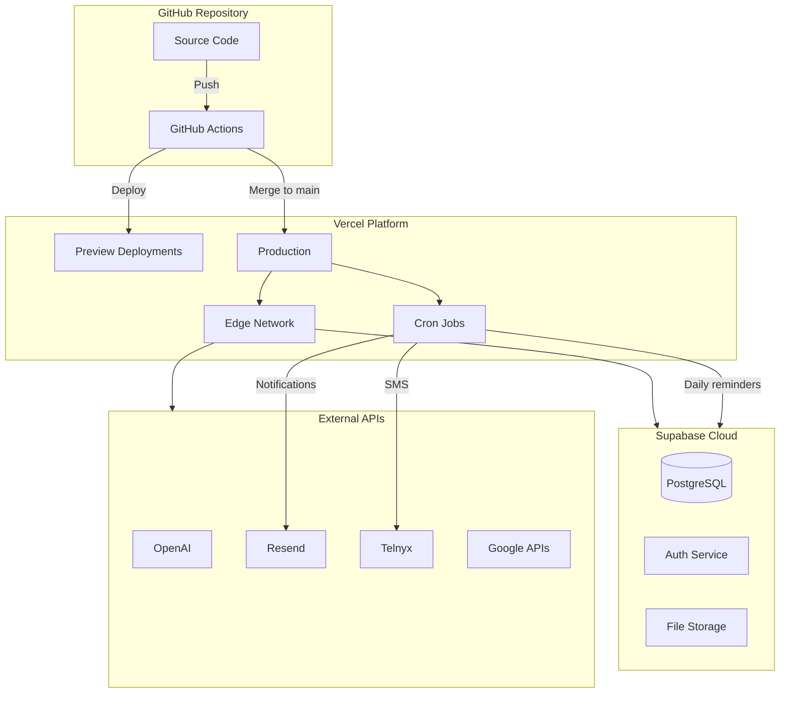

# Cyber Tech - Technical Documentation

## Architecture & Technical Specifications

**Version:** 1.0  
**Last Updated:** December 21, 2025

---

## 1. Technology Stack

### Core Technologies

| Layer | Technology | Version | Purpose |
|-------|------------|---------|---------|
| **Framework** | Next.js | 14.x | React framework with App Router |
| **Language** | TypeScript | 5.x | Type-safe JavaScript |
| **Styling** | Tailwind CSS | 3.x | Utility-first CSS |
| **UI Components** | shadcn/ui | Latest | Base component library |
| **Database** | PostgreSQL | 15.x | Via Supabase |
| **Auth** | Supabase Auth | Latest | Authentication & authorization |
| **AI** | Vercel AI SDK | 3.x | GPT-4 integration |
| **Deployment** | Vercel | - | Hosting & serverless functions |

### UI Library Stack

| Category | Library | Purpose |
|----------|---------|---------|
| Core Components | shadcn/ui | Buttons, forms, dialogs, base components |
| Animations | Magic UI | Animated cards, text effects, micro-interactions |
| Data Tables | tablecn | Sortable, filterable data tables |
| Calendar | FullCalendar | Rota calendar views |
| Date Picker | React DayPicker | Date selection inputs |
| Charts | shadcn/ui Charts (Recharts) | Analytics visualizations |
| Toasts | Sonner | Notification toasts |
| Command Palette | cmdk | Quick search & navigation |
| Mobile Drawer | Vaul | Mobile navigation |
| Carousel | Embla Carousel | Image galleries |
| Drag & Drop | @dnd-kit | Rundown editor, rota assignments |

### External Services

| Service | Purpose | Pricing |
|---------|---------|---------|
| Supabase | Database, Auth, Storage | Free tier + pay-as-you-go |
| OpenAI | GPT-4 API | Pay-per-token |
| Resend | Transactional emails | Free: 3,000/mo |
| Telnyx | SMS notifications | ~$0.004/SMS |
| Google Drive API | Photo fetching | Free |
| Vercel | Hosting | Free tier available |

---

## 2. System Architecture

### High-Level Architecture



### Request Flow



### Component Architecture

```mermaid
flowchart TB
    subgraph App["App Router Structure"]
        Layout[Root Layout]
        Auth["(auth) Group"]
        Dashboard["(dashboard) Group"]
        API["API Routes"]
    end

    subgraph AuthPages["Auth Pages"]
        Login[Login]
        Register[Register]
        Reset[Password Reset]
    end

    subgraph DashPages["Dashboard Pages"]
        Home[Dashboard Home]
        Rota[Rota Management]
        Live[Livestream]
        Social[Social Media]
        Equip[Equipment]
        Rundown[Rundown Builder]
        Training[Training]
    end

    subgraph APIRoutes["API Routes"]
        AIRoute[/api/ai/*]
        AuthRoute[/api/auth/*]
        CronRoute[/api/cron/*]
    end

    Layout --> Auth
    Layout --> Dashboard
    Layout --> API
    Auth --> AuthPages
    Dashboard --> DashPages
    API --> APIRoutes
```

---

## 3. Database Schema

### Entity Relationship Diagram

```mermaid
erDiagram
    PROFILES ||--o{ ROTA_ASSIGNMENTS : has
    PROFILES ||--o{ AVAILABILITY : submits
    PROFILES ||--o{ EQUIPMENT_CHECKOUTS : makes
    PROFILES ||--o{ MEMBER_PROGRESS : tracks
    PROFILES }|--|| DEPARTMENTS : belongs_to
    
    DEPARTMENTS ||--o{ POSITIONS : has
    DEPARTMENTS ||--o{ ONBOARDING_TRACKS : has
    
    SERVICES ||--o{ ROTAS : has
    ROTAS ||--o{ ROTA_ASSIGNMENTS : contains
    POSITIONS ||--o{ ROTA_ASSIGNMENTS : assigned_to
    
    ROTAS ||--o{ LIVESTREAMS : has
    
    EQUIPMENT ||--o{ EQUIPMENT_CHECKOUTS : tracked_by
    EQUIPMENT ||--o{ EQUIPMENT_MAINTENANCE : scheduled_for
    EQUIPMENT }|--|| EQUIPMENT_CATEGORIES : categorized_by
    
    RUNDOWNS ||--o{ RUNDOWN_ITEMS : contains
    SONGS ||--o{ RUNDOWN_ITEMS : referenced_by
    
    ONBOARDING_TRACKS ||--o{ ONBOARDING_STEPS : contains
    ONBOARDING_TRACKS ||--o{ MEMBER_PROGRESS : enrolled_in
    ONBOARDING_STEPS ||--o{ STEP_COMPLETIONS : completed_as

    PROFILES {
        uuid id PK
        uuid auth_user_id FK
        string email
        string name
        string phone
        string avatar_url
        enum role
        uuid department_id FK
        jsonb notification_preferences
        timestamp created_at
        timestamp updated_at
    }

    DEPARTMENTS {
        uuid id PK
        string name
        string description
        uuid leader_id FK
        string color
        timestamp created_at
    }

    POSITIONS {
        uuid id PK
        string name
        uuid department_id FK
        string description
        int min_members
        int max_members
        timestamp created_at
    }

    SERVICES {
        uuid id PK
        string name
        int day_of_week
        time start_time
        time end_time
        boolean is_recurring
        string location
    }

    ROTAS {
        uuid id PK
        uuid service_id FK
        date date
        enum status
        uuid created_by FK
        timestamp published_at
        timestamp created_at
    }

    ROTA_ASSIGNMENTS {
        uuid id PK
        uuid rota_id FK
        uuid user_id FK
        uuid position_id FK
        enum status
        timestamp confirmed_at
        timestamp created_at
    }

    AVAILABILITY {
        uuid id PK
        uuid user_id FK
        date date
        boolean is_available
        string notes
        timestamp created_at
    }

    SWAP_REQUESTS {
        uuid id PK
        uuid original_assignment_id FK
        uuid requester_id FK
        uuid target_user_id FK
        enum status
        string reason
        timestamp created_at
        timestamp resolved_at
    }

    LIVESTREAMS {
        uuid id PK
        uuid rota_id FK
        string title
        text youtube_description
        text facebook_description
        string speaker
        string scripture
        jsonb metadata
        timestamp created_at
    }

    SOCIAL_POSTS {
        uuid id PK
        text content
        jsonb media_urls
        jsonb platforms
        timestamp scheduled_for
        timestamp published_at
        enum status
        uuid created_by FK
        timestamp created_at
    }

    EQUIPMENT {
        uuid id PK
        string name
        uuid category_id FK
        string serial_number
        string model
        string manufacturer
        date purchase_date
        decimal purchase_price
        date warranty_expires
        string location
        enum status
        string qr_code
        timestamp created_at
    }

    EQUIPMENT_CATEGORIES {
        uuid id PK
        string name
        uuid parent_id FK
        string icon
    }

    EQUIPMENT_CHECKOUTS {
        uuid id PK
        uuid equipment_id FK
        uuid checked_out_by FK
        timestamp checked_out_at
        timestamp expected_return
        timestamp returned_at
        string condition_on_return
        text notes
    }

    EQUIPMENT_MAINTENANCE {
        uuid id PK
        uuid equipment_id FK
        enum type
        text description
        uuid performed_by FK
        timestamp performed_at
        date next_due
        decimal cost
        string vendor
    }

    RUNDOWNS {
        uuid id PK
        uuid service_id FK
        date date
        string title
        int version
        enum status
        uuid created_by FK
        uuid approved_by FK
        timestamp created_at
    }

    RUNDOWN_ITEMS {
        uuid id PK
        uuid rundown_id FK
        int order
        enum type
        string title
        int duration_seconds
        time start_time
        text notes
        uuid assigned_to FK
        string media_url
    }

    SONGS {
        uuid id PK
        string title
        string artist
        string key
        int tempo
        string ccli_number
        text lyrics
        string chord_chart_url
        timestamp created_at
    }

    ONBOARDING_TRACKS {
        uuid id PK
        uuid department_id FK
        string name
        text description
        int steps_count
        int estimated_weeks
        timestamp created_at
    }

    ONBOARDING_STEPS {
        uuid id PK
        uuid track_id FK
        int order
        string title
        text description
        enum type
        string content_url
        boolean required
        int pass_score
    }

    MEMBER_PROGRESS {
        uuid id PK
        uuid user_id FK
        uuid track_id FK
        timestamp started_at
        timestamp completed_at
        enum status
    }

    STEP_COMPLETIONS {
        uuid id PK
        uuid member_progress_id FK
        uuid step_id FK
        timestamp completed_at
        int score
        int attempts
        uuid mentor_verified_by FK
    }

    NOTIFICATIONS {
        uuid id PK
        uuid user_id FK
        string type
        enum channel
        string title
        text body
        jsonb data
        timestamp sent_at
        timestamp read_at
        enum status
    }

    NOTIFICATION_PREFERENCES {
        uuid id PK
        uuid user_id FK
        string notification_type
        boolean email_enabled
        boolean sms_enabled
        string reminder_timing
    }
```



---

## 4. Project Structure

```
cyber-tech/
├── app/
│   ├── (auth)/
│   │   ├── login/
│   │   │   └── page.tsx
│   │   ├── register/
│   │   │   └── page.tsx
│   │   ├── forgot-password/
│   │   │   └── page.tsx
│   │   └── layout.tsx
│   │
│   ├── (dashboard)/
│   │   ├── layout.tsx                    # Dashboard shell with sidebar
│   │   ├── page.tsx                      # Dashboard home
│   │   │
│   │   ├── rota/
│   │   │   ├── page.tsx                  # Calendar view
│   │   │   ├── [id]/
│   │   │   │   └── page.tsx              # Single rota detail
│   │   │   ├── create/
│   │   │   │   └── page.tsx
│   │   │   ├── my-schedule/
│   │   │   │   └── page.tsx
│   │   │   └── availability/
│   │   │       └── page.tsx
│   │   │
│   │   ├── livestream/
│   │   │   ├── page.tsx                  # Generator + history
│   │   │   ├── [id]/
│   │   │   │   └── page.tsx              # View/edit saved
│   │   │   └── templates/
│   │   │       └── page.tsx
│   │   │
│   │   ├── social/
│   │   │   ├── page.tsx                  # Social dashboard
│   │   │   ├── drive/
│   │   │   │   └── page.tsx              # Google Drive browser
│   │   │   ├── scheduler/
│   │   │   │   └── page.tsx
│   │   │   └── templates/
│   │   │       └── page.tsx
│   │   │
│   │   ├── equipment/
│   │   │   ├── page.tsx                  # Inventory list
│   │   │   ├── [id]/
│   │   │   │   └── page.tsx              # Equipment detail
│   │   │   ├── checkout/
│   │   │   │   └── page.tsx
│   │   │   ├── maintenance/
│   │   │   │   └── page.tsx
│   │   │   ├── categories/
│   │   │   │   └── page.tsx
│   │   │   └── scan/
│   │   │       └── page.tsx              # QR scanner
│   │   │
│   │   ├── rundown/
│   │   │   ├── page.tsx                  # Rundown list
│   │   │   ├── [id]/
│   │   │   │   ├── page.tsx              # Editor
│   │   │   │   └── live/
│   │   │   │       └── page.tsx          # Live view
│   │   │   ├── templates/
│   │   │   │   └── page.tsx
│   │   │   └── songs/
│   │   │       └── page.tsx              # Song library
│   │   │
│   │   ├── training/
│   │   │   ├── page.tsx                  # Training dashboard
│   │   │   ├── tracks/
│   │   │   │   ├── page.tsx
│   │   │   │   └── [id]/
│   │   │   │       └── page.tsx
│   │   │   ├── my-progress/
│   │   │   │   └── page.tsx
│   │   │   ├── resources/
│   │   │   │   └── page.tsx
│   │   │   └── certifications/
│   │   │       └── page.tsx
│   │   │
│   │   ├── team/
│   │   │   ├── page.tsx                  # Team directory
│   │   │   ├── [id]/
│   │   │   │   └── page.tsx              # Member profile
│   │   │   └── departments/
│   │   │       └── page.tsx
│   │   │
│   │   ├── admin/
│   │   │   ├── page.tsx
│   │   │   ├── users/
│   │   │   │   └── page.tsx
│   │   │   ├── settings/
│   │   │   │   └── page.tsx
│   │   │   └── integrations/
│   │   │       └── page.tsx
│   │   │
│   │   └── settings/
│   │       ├── page.tsx
│   │       ├── profile/
│   │       │   └── page.tsx
│   │       └── notifications/
│   │           └── page.tsx
│   │
│   ├── api/
│   │   ├── ai/
│   │   │   ├── generate-description/
│   │   │   │   └── route.ts
│   │   │   ├── generate-caption/
│   │   │   │   └── route.ts
│   │   │   └── chat/
│   │   │       └── route.ts
│   │   ├── cron/
│   │   │   └── send-reminders/
│   │   │       └── route.ts
│   │   └── webhooks/
│   │       └── telnyx/
│   │           └── route.ts
│   │
│   ├── manifest.ts                       # PWA manifest
│   ├── layout.tsx                        # Root layout
│   ├── page.tsx                          # Landing/redirect
│   └── globals.css
│
├── components/
│   ├── ui/                               # shadcn/ui components
│   │   ├── button.tsx
│   │   ├── card.tsx
│   │   ├── dialog.tsx
│   │   ├── form.tsx
│   │   ├── input.tsx
│   │   ├── select.tsx
│   │   ├── table.tsx
│   │   └── ...
│   │
│   ├── magicui/                          # Magic UI components
│   │   ├── animated-card.tsx
│   │   ├── shimmer-button.tsx
│   │   └── ...
│   │
│   ├── layout/
│   │   ├── sidebar.tsx
│   │   ├── header.tsx
│   │   ├── mobile-nav.tsx
│   │   └── command-menu.tsx
│   │
│   ├── rota/
│   │   ├── rota-calendar.tsx
│   │   ├── assignment-card.tsx
│   │   ├── availability-picker.tsx
│   │   └── swap-request-modal.tsx
│   │
│   ├── livestream/
│   │   ├── description-form.tsx
│   │   ├── description-preview.tsx
│   │   └── template-editor.tsx
│   │
│   ├── social/
│   │   ├── drive-browser.tsx
│   │   ├── post-composer.tsx
│   │   ├── platform-preview.tsx
│   │   └── scheduling-queue.tsx
│   │
│   ├── equipment/
│   │   ├── inventory-table.tsx
│   │   ├── qr-scanner.tsx
│   │   ├── qr-generator.tsx
│   │   ├── checkout-form.tsx
│   │   └── maintenance-scheduler.tsx
│   │
│   ├── rundown/
│   │   ├── rundown-editor.tsx
│   │   ├── rundown-item.tsx
│   │   ├── song-picker.tsx
│   │   ├── duration-tracker.tsx
│   │   └── live-view.tsx
│   │
│   ├── training/
│   │   ├── track-card.tsx
│   │   ├── step-card.tsx
│   │   ├── progress-tracker.tsx
│   │   └── certification-badge.tsx
│   │
│   └── shared/
│       ├── loading.tsx
│       ├── error-boundary.tsx
│       ├── empty-state.tsx
│       └── confirm-dialog.tsx
│
├── lib/
│   ├── supabase/
│   │   ├── client.ts                     # Browser client
│   │   ├── server.ts                     # Server client
│   │   ├── middleware.ts                 # Auth middleware
│   │   └── admin.ts                      # Admin client
│   │
│   ├── ai/
│   │   ├── openai.ts                     # OpenAI config
│   │   └── prompts/
│   │       ├── livestream-description.ts
│   │       └── social-caption.ts
│   │
│   ├── notifications/
│   │   ├── email.ts                      # Resend client
│   │   ├── sms.ts                        # Telnyx client
│   │   └── templates/
│   │       ├── rota-reminder.tsx
│   │       ├── swap-request.tsx
│   │       └── welcome.tsx
│   │
│   ├── integrations/
│   │   └── google-drive.ts               # Drive API client
│   │
│   ├── utils.ts                          # Utility functions
│   ├── constants.ts                      # App constants
│   └── validations/
│       ├── rota.ts
│       ├── equipment.ts
│       └── rundown.ts
│
├── hooks/
│   ├── use-user.ts
│   ├── use-rota.ts
│   ├── use-equipment.ts
│   ├── use-rundown.ts
│   └── use-media-query.ts
│
├── types/
│   ├── database.ts                       # Supabase generated types
│   ├── api.ts
│   └── index.ts
│
├── emails/                               # React Email templates
│   ├── rota-reminder.tsx
│   ├── swap-request.tsx
│   ├── training-complete.tsx
│   └── welcome.tsx
│
├── public/
│   ├── icons/
│   │   ├── icon-192.png
│   │   ├── icon-512.png
│   │   └── apple-touch-icon.png
│   └── images/
│
├── supabase/
│   ├── migrations/
│   │   ├── 00001_initial_schema.sql
│   │   ├── 00002_rls_policies.sql
│   │   └── ...
│   ├── seed.sql
│   └── config.toml
│
├── .github/
│   ├── docs/
│   │   ├── PRODUCT_SPEC.md
│   │   └── TECH_DOCS.md
│   └── workflows/
│       └── deploy.yml
│
├── .env.example
├── .env.local
├── .gitignore
├── components.json                       # shadcn/ui config
├── middleware.ts                         # Next.js middleware
├── next.config.mjs
├── package.json
├── postcss.config.js
├── tailwind.config.ts
└── tsconfig.json
```

---

## 5. API Design

### AI Routes

#### Generate Livestream Description

```typescript
// POST /api/ai/generate-description
// Request
{
  "serviceDate": "2025-12-22",
  "serviceType": "Sunday Service",
  "title": "Walking in Divine Favor",
  "speaker": "Pastor John Smith",
  "scripture": "Psalm 23:1-6",
  "keyPoints": ["Point 1", "Point 2"],
  "platform": "youtube" | "facebook"
}

// Response (Streaming)
data: {"text": "Join us for..."}
data: {"text": " an inspiring..."}
data: {"done": true}
```

#### Generate Social Caption

```typescript
// POST /api/ai/generate-caption
// Request
{
  "context": "Sunday service recap",
  "sermonTitle": "Walking in Divine Favor",
  "platform": "instagram",
  "tone": "inspiring",
  "includeHashtags": true
}

// Response (Streaming)
data: {"text": "What a powerful..."}
```

### Data Flow Diagrams

#### Rota Creation Flow



#### Equipment Checkout Flow



#### Notification Reminder Flow



---

## 6. Authentication Flow



### Middleware Configuration

```typescript
// middleware.ts
import { createServerClient } from '@supabase/ssr'
import { NextResponse } from 'next/server'
import type { NextRequest } from 'next/server'

export async function middleware(request: NextRequest) {
  const response = NextResponse.next()
  
  const supabase = createServerClient(
    process.env.NEXT_PUBLIC_SUPABASE_URL!,
    process.env.NEXT_PUBLIC_SUPABASE_ANON_KEY!,
    {
      cookies: {
        get: (name) => request.cookies.get(name)?.value,
        set: (name, value, options) => response.cookies.set({ name, value, ...options }),
        remove: (name, options) => response.cookies.set({ name, value: '', ...options }),
      },
    }
  )

  const { data: { session } } = await supabase.auth.getSession()

  // Protect dashboard routes
  if (request.nextUrl.pathname.startsWith('/dashboard') && !session) {
    return NextResponse.redirect(new URL('/login', request.url))
  }

  // Redirect authenticated users from auth pages
  if (request.nextUrl.pathname.startsWith('/login') && session) {
    return NextResponse.redirect(new URL('/dashboard', request.url))
  }

  return response
}

export const config = {
  matcher: ['/dashboard/:path*', '/login', '/register'],
}
```

---

## 7. PWA Configuration

### Manifest

```typescript
// app/manifest.ts
import type { MetadataRoute } from 'next'

export default function manifest(): MetadataRoute.Manifest {
  return {
    name: 'Cyber Tech - Church Tech Management',
    short_name: 'Cyber Tech',
    description: 'Manage your church tech department',
    start_url: '/dashboard',
    display: 'standalone',
    background_color: '#ffffff',
    theme_color: '#0f172a',
    orientation: 'portrait-primary',
    icons: [
      {
        src: '/icons/icon-192.png',
        sizes: '192x192',
        type: 'image/png',
      },
      {
        src: '/icons/icon-512.png',
        sizes: '512x512',
        type: 'image/png',
      },
      {
        src: '/icons/icon-512.png',
        sizes: '512x512',
        type: 'image/png',
        purpose: 'maskable',
      },
    ],
  }
}
```

### Service Worker Strategy

```typescript
// Using next-pwa or serwist
// Cache strategies:
// - Static assets: Cache First
// - API routes: Network First
// - Pages: Stale While Revalidate
```

---

## 8. Environment Variables

```bash
# .env.example

# Supabase
NEXT_PUBLIC_SUPABASE_URL=https://your-project.supabase.co
NEXT_PUBLIC_SUPABASE_ANON_KEY=your-anon-key
SUPABASE_SERVICE_ROLE_KEY=your-service-role-key

# OpenAI
OPENAI_API_KEY=sk-...

# Resend (Email)
RESEND_API_KEY=re_...
RESEND_FROM_EMAIL=tech@yourchurch.org

# Telnyx (SMS)
TELNYX_API_KEY=KEY...
TELNYX_PHONE_NUMBER=+1234567890

# Google Drive
GOOGLE_CLIENT_ID=...
GOOGLE_CLIENT_SECRET=...
GOOGLE_DRIVE_FOLDER_ID=...

# App
NEXT_PUBLIC_APP_URL=https://yourapp.vercel.app
CRON_SECRET=your-cron-secret
```

---

## 9. Deployment Architecture



---

## 10. Security Considerations

### Row Level Security (RLS) Policies

```sql
-- Example RLS policies for rotas table
-- Users can view published rotas
CREATE POLICY "View published rotas"
ON rotas FOR SELECT
USING (status = 'published' OR auth.uid() IN (
  SELECT user_id FROM profiles WHERE role IN ('admin', 'leader')
));

-- Only admins and leaders can create rotas
CREATE POLICY "Create rotas"
ON rotas FOR INSERT
WITH CHECK (auth.uid() IN (
  SELECT user_id FROM profiles WHERE role IN ('admin', 'leader')
));

-- Only admins and leaders can update rotas
CREATE POLICY "Update rotas"
ON rotas FOR UPDATE
USING (auth.uid() IN (
  SELECT user_id FROM profiles WHERE role IN ('admin', 'leader')
));
```

### API Security

- All API routes validate session
- Rate limiting on AI endpoints
- CORS configured for production domain only
- Sensitive operations require admin role check

---

## 11. Development Setup

```bash
# Clone repository
git clone <repo-url>
cd cyber-tech

# Install dependencies
npm install

# Set up environment variables
cp .env.example .env.local
# Fill in your values

# Set up Supabase locally (optional)
npx supabase init
npx supabase start

# Run database migrations
npx supabase db push

# Start development server
npm run dev

# Build for production
npm run build

# Type checking
npm run type-check

# Linting
npm run lint
```

---

## 12. Testing Strategy

| Type | Tool | Coverage Target |
|------|------|-----------------|
| Unit Tests | Vitest | Core utilities, hooks |
| Component Tests | React Testing Library | UI components |
| Integration Tests | Playwright | Critical user flows |
| E2E Tests | Playwright | Happy paths |

### Critical Test Scenarios

1. User authentication flow
2. Rota creation and assignment
3. Livestream description generation
4. Equipment checkout/return
5. Notification delivery

---

## 13. Monitoring & Observability

| Aspect | Tool | Purpose |
|--------|------|---------|
| Error Tracking | Sentry | Capture and alert on errors |
| Analytics | Vercel Analytics | Page views, performance |
| Logs | Vercel Logs / Axiom | API and function logs |
| Uptime | Vercel / UptimeRobot | Availability monitoring |

---

## 14. Version History

| Version | Date | Changes |
|---------|------|---------|
| 1.0 | 2025-12-21 | Initial documentation |
