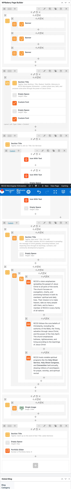
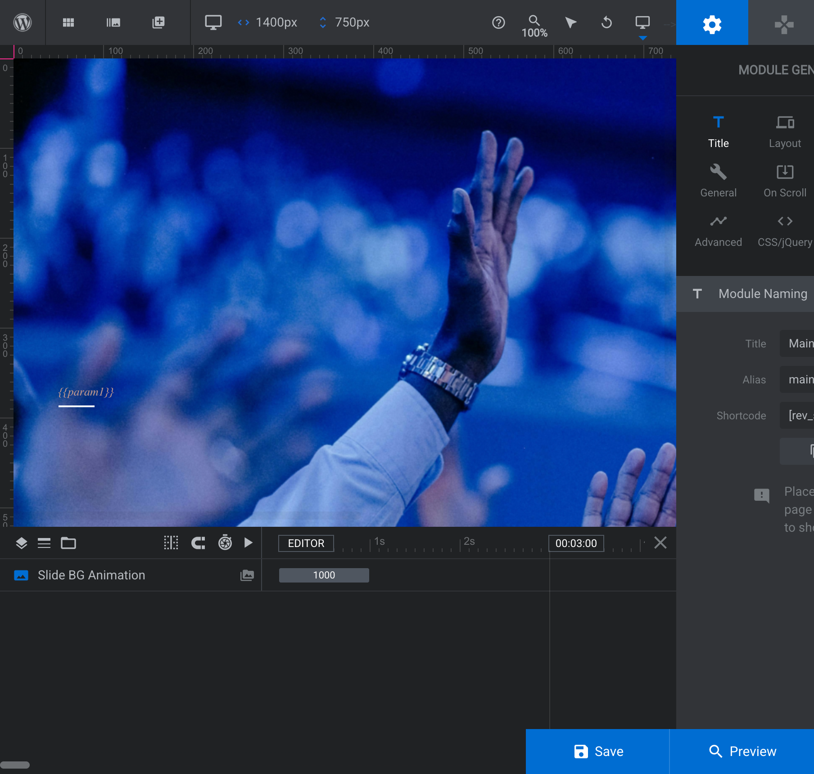
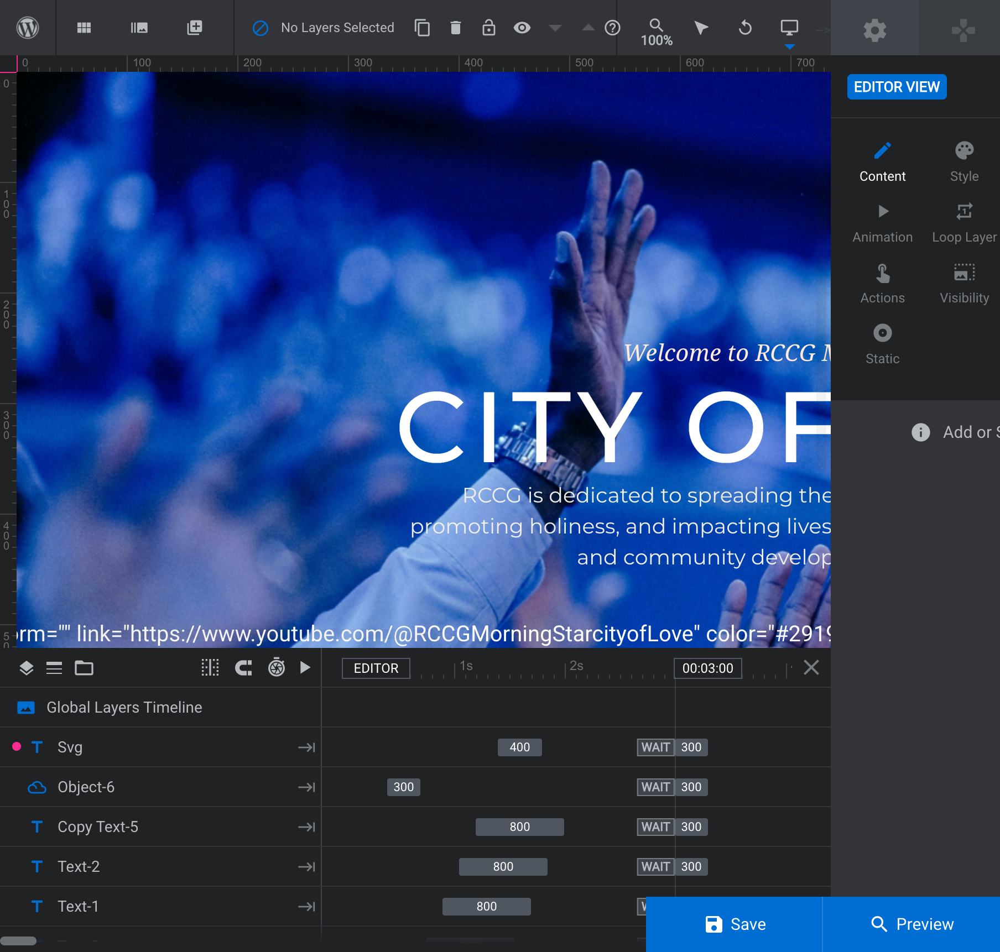
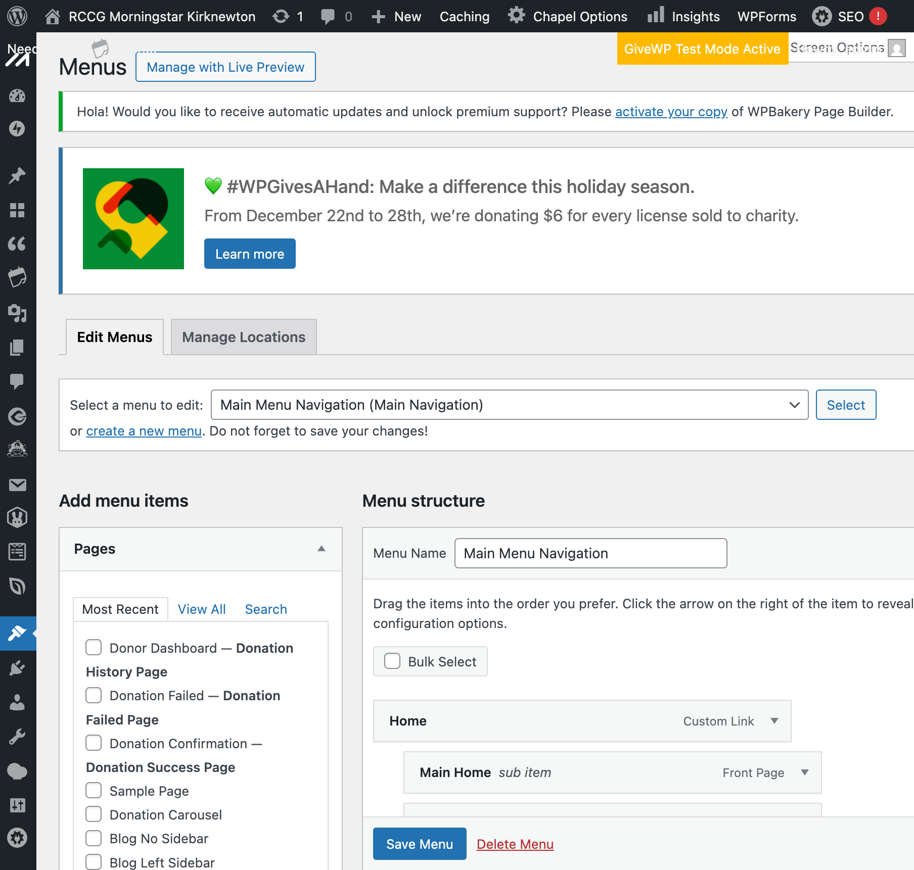

# RCCG Morningstar WordPress Admin Guide

**Site**: https://rccgmorningstaredinburgh.org/  
**Admin Panel**: https://rccgmorningstaredinburgh.org/wp-admin/  
**Credentials**: See `.github/docs/test-credentials`

---

## Table of Contents

1. [Quick Access URLs](#quick-access-urls)
2. [Theme & Page Builder Overview](#theme--page-builder-overview)
3. [Editing Pages with WPBakery](#editing-pages-with-wpbakery)
4. [Editing Sliders with Slider Revolution](#editing-sliders-with-slider-revolution)
5. [Managing Menus](#managing-menus)
6. [Key Plugins Reference](#key-plugins-reference)
7. [Common Tasks](#common-tasks)
8. [Troubleshooting](#troubleshooting)

---

## Quick Access URLs

| Resource | URL |
|----------|-----|
| WordPress Admin | `/wp-admin/` |
| All Pages | `/wp-admin/edit.php?post_type=page` |
| Menus | `/wp-admin/nav-menus.php` |
| Slider Revolution | `/wp-admin/admin.php?page=revslider` |
| GiveWP Donations | `/wp-admin/edit.php?post_type=give_forms&page=give-campaigns` |
| Events Calendar | `/wp-admin/edit.php?post_type=tribe_events` |
| Chapel Portfolio (Sermons) | `/wp-admin/edit.php?post_type=portfolio-item` |
| Contact Forms | `/wp-admin/admin.php?page=wpcf7` |
| Theme Options | `/wp-admin/admin.php?page=chapel_elated_theme_menu` |

---

## Theme & Page Builder Overview

### Theme: Chapel
- Church-focused WordPress theme by Elated Themes
- Includes custom post types: Portfolio (used for sermons), Testimonials
- Theme options accessible via **Chapel Options** in left sidebar

### Page Builder: WPBakery Page Builder
- Visual drag-and-drop page builder
- Content stored as shortcodes in page content
- Two editing modes: **Backend Editor** and **Frontend Editor**

### Slider Plugin: Slider Revolution 6.6.20
- Creates animated hero sliders
- Separate from page content - edited via its own interface
- Main-Home slider is used on the homepage hero section

---

## Editing Pages with WPBakery

### Method 1: Visual Editor (Recommended for Simple Edits)

1. Go to **Pages → All Pages**
2. Hover over the page and click **Edit**
3. Click **"Edit with WPBakery Page Builder"** button (blue, top of content area)
4. Use the visual interface to edit elements
5. Click **Update** to save

### Method 2: Backend Editor



1. In the page editor, click **"Backend Editor"** tab
2. You'll see a structured view of rows, columns, and elements
3. Click on any element's pencil icon to edit
4. Useful for accessing element settings that aren't visible in frontend

### Method 3: Text/Code Editor (For Direct Shortcode Editing)

1. In the page editor, look for the **"Text"** or **"Code Editor"** tab
2. You'll see raw shortcodes like:
   ```
   [vc_row][vc_column][vc_single_image image="123" link="#"][/vc_column][/vc_row]
   ```
3. Edit shortcode attributes directly
4. **Use this for**: Changing links, image IDs, text content

### Key Shortcode Attributes

| Attribute | Purpose | Example |
|-----------|---------|---------|
| `link` | URL the element links to | `link="https://youtube.com/..."` |
| `video_link` | Video URL for video elements | `video_link="https://youtube.com/..."` |
| `image` | WordPress media library ID | `image="1234"` |
| `title` | Element title/heading | `title="Watch On The Go"` |

### Main Home Page

- **Page ID**: 19
- **Direct Edit URL**: `/wp-admin/post.php?post=19&action=edit`
- **Content Structure**:
  - Hero Slider (Slider Revolution shortcode)
  - Quick Action Cards (Listen, Watch, Give)
  - Services Section
  - About/Welcome Section
  - Events Widget
  - Sermons Carousel
  - Footer Widgets

---

## Editing Sliders with Slider Revolution

### Accessing Slider Revolution

1. Go to **Slider Revolution** in the left sidebar
2. Or directly: `/wp-admin/admin.php?page=revslider`

### Navigating to a Slider

1. On the Overview page, you'll see slider thumbnails
2. **Click once** on a slider to see its slides
3. **Double-click** on a slide to open the editor

### Key Sliders

| Slider Name | Alias | Used On | Slides |
|-------------|-------|---------|--------|
| Main-Home | `main-home` | Homepage hero | 3 slides |
| Main-Home1 | - | Alternative (unused?) | - |

### Editing a Layer (Button, Text, Image)



1. In the slide editor, find the **Layer List** (bottom-left timeline area)
2. Click on the layer name to select it
3. The right panel shows layer options:



| Tab | Purpose |
|-----|---------|
| **Content** | Edit text, change images |
| **Style** | Colors, fonts, spacing |
| **Size & Pos** | Position and dimensions |
| **Actions** | Links, click behaviors |
| **Visibility** | Show/hide on devices |

### Adding/Editing Links on Buttons

1. Select the button layer
2. Click **"Actions"** tab (finger/touch icon)
3. Look for existing action or click **"+"** to add new
4. Choose **"Simple Link"**
5. Enter URL and set Target (`_blank` for new tab)
6. Click **Save** (blue button, bottom right)

### Slider Shortcode

To embed a slider on a page:
```
[rev_slider alias="main-home"][/rev_slider]
```

---

## Managing Menus

### Accessing Menus

1. Go to **Appearance → Menus**


2. Or directly: `/wp-admin/nav-menus.php`

### Menu Structure

| Menu Name | Menu ID | Assigned Locations | Purpose |
|-----------|---------|-------------------|---------|
| Main Menu Navigation | 29 | Main Navigation | Full desktop navigation (inner pages) |
| Divided Left Menu | 28 | Mobile Navigation, Divided Left Navigation, Full Screen Navigation | Left side of homepage header + mobile |
| Divided Right Menu | 27 | Divided Right Navigation | Right side of homepage header (Events, Gallery, Messages) |
| Full Screen Menu | - | (Unused) | Alternative navigation option |

> **Important**: The homepage uses the "Divided Header" style, which displays Divided Left Menu on the left and Divided Right Menu on the right. For changes to appear on the homepage navigation, update the appropriate Divided menu. The Main Menu Navigation is used on inner pages.

### Menu Item Types

1. **Custom Links**: Manual URL + label
2. **Pages**: Links to WordPress pages
3. **Categories**: Links to category archives

### Dropdown Behavior

- Top-level items with children are **dropdown triggers**
- These have "Don't link" checked (URL `#`)
- Clicking shows the dropdown; doesn't navigate

### Editing a Menu Item

1. Click the arrow (▼) next to the menu item to expand
2. Edit the **URL** field
3. Edit the **Navigation Label**
4. Check/uncheck **"Don't link"** as needed
5. Click **Save Menu**

---

## Key Plugins Reference

### GiveWP (Donations)

- **Status**: Installed, Test Mode Active
- **Dashboard**: GiveWP → Campaigns
- **Settings**: GiveWP → Settings
- **Note**: Needs payment gateway configuration before going live

### The Events Calendar

- **Purpose**: Church events management
- **Add Event**: Events → Add New Event
- **Settings**: Events → Settings
- **Note**: Currently no events added (widget shows "no posts")

### Contact Form 7

- **Purpose**: Contact forms
- **Dashboard**: Contact → Contact Forms
- **Note**: Footer uses this for contact form

### WPForms

- **Purpose**: Alternative form builder
- **Dashboard**: WPForms → All Forms
- **Note**: Also installed; check which forms use which plugin

### AIOSEO (All in One SEO)

- **Purpose**: SEO management
- **Dashboard**: All in One SEO → Dashboard
- **Use for**: Page titles, meta descriptions, sitemaps

### Chapel Portfolio

- **Purpose**: Sermon/message archive
- **Dashboard**: Chapel Portfolio
- **Add New**: Chapel Portfolio → Add New Portfolio Item
- **Categories**: Used to organize sermons

---

## Common Tasks

### Task: Change a Button Link

**If in WPBakery page:**
1. Edit page → WPBakery Backend Editor
2. Find the button element
3. Edit → change URL field
4. Update page

**If in Slider Revolution:**
1. Open slider → select slide → select button layer
2. Actions tab → Edit link URL
3. Save slider

### Task: Add a New Event

1. Go to **Events → Add New Event**
2. Fill in: Title, Date/Time, Description, Venue
3. Set Featured Image
4. Publish

### Task: Add a New Sermon

1. Go to **Chapel Portfolio → Add New Portfolio Item**
2. Fill in: Title, Description, Featured Image
3. Assign to "Sermons" category (if exists)
4. Publish

### Task: Update Contact Info

1. **In Theme Options**: Chapel Options → Footer (for footer content)
2. **In Pages**: Edit the specific page
3. **In Widgets**: Appearance → Widgets (for sidebar/footer widgets)

### Task: Change Logo

1. Go to **Chapel Options → Logo**
2. Upload new logo images (light/dark versions)
3. Save

---

## Troubleshooting

### Problem: Changes Not Showing on Live Site

**Solutions:**
1. Clear browser cache (Cmd+Shift+R / Ctrl+Shift+R)
2. Add `?nocache=1` to URL to bypass cache
3. Check if page is published (not draft)
4. Clear any caching plugin cache

### Problem: WPBakery Editor Not Loading

**Solutions:**
1. Try Backend Editor instead of Frontend Editor
2. Disable conflicting plugins temporarily
3. Check browser console for JavaScript errors

### Problem: Slider Not Updating

**Solutions:**
1. Make sure you clicked **Save** in Slider Revolution
2. Clear page cache
3. Check slider shortcode is correct on the page

### Problem: Menu Changes Not Appearing

**Solutions:**
1. Make sure you clicked **Save Menu**
2. Check the correct menu is assigned to the right location
3. Clear cache

### Problem: Forms Not Sending

**Solutions:**
1. Check Contact Form 7 settings
2. Verify email address in form settings
3. Check spam folder
4. Test with different email addresses

---

## File Locations

| Asset | Location |
|-------|----------|
| This guide | `.github/docs/wordpress-mgmt/admin-guide.md` |
| Task list | `.github/docs/wordpress-mgmt/tasks.md` |
| Credentials | `.github/docs/test-credentials` |
| Screenshots | `.github/docs/wordpress-mgmt/screenshots/` |

### Screenshots Folder Structure

```
screenshots/
├── README.md              ← Naming conventions & tips
├── general/               ← General navigation screenshots
├── slider-revolution/     ← Slider Revolution tutorials
├── wpbakery/              ← WPBakery Page Builder tutorials
├── menus/                 ← Menu management tutorials
└── completed-tasks/       ← Before/after screenshots
```

### Screenshot Naming Convention

Format: `{task-id}_{step-number}_{description}.png`

Examples:
- `t011_01_slider-revolution-overview.png`
- `t011_02_select-layer-copy-text-5.png`
- `t011_03_actions-tab-link-url.png`

---

## Changelog

| Date | Author | Changes |
|------|--------|---------|
| 2024-12-23 | AI Assistant | Initial guide created |
| 2024-12-23 | AI Assistant | Completed T001, T002, T022, T024 - navigation fixes and contact form update |

---

## Notes & Lessons Learned

1. **Slider Revolution layers**: Button layers store their links in the "Actions" tab, not in content or style settings.

2. **WPBakery shortcodes**: Links are stored as attributes like `link="#"`. Can be edited directly in the text/code view.

3. **Menu dropdowns**: Top-level items with "Don't link" checked act as dropdown triggers only - clicking them doesn't navigate.

4. **Page IDs**: Useful for direct edit URLs. Main Home = 19.

5. **Test Mode**: GiveWP is in test mode - remember to switch to live mode with real payment gateway before accepting real donations.

6. **Cache**: Always clear cache after changes, or use `?nocache=1` parameter to verify changes.

7. **Chapel Theme Menu Structure (IMPORTANT)**: The Chapel theme uses a "Divided Header" layout with multiple menus:
   - **Divided Left Menu (ID 28)**: Assigned to Mobile Navigation, Divided Left Navigation, Full Screen Navigation
   - **Divided Right Menu (ID 27)**: Assigned to Divided Right Navigation (right side of homepage header)
   - **Main Menu Navigation (ID 29)**: Assigned to Main Navigation location
   - When making navigation changes that should appear on the homepage, you may need to update **both** the Main Menu Navigation AND the Divided Right Menu.

8. **Contact Form 7 Configuration**: The footer contact form is managed by Contact Form 7 plugin (post ID 979, form name "Footer"). Email settings are in the **Mail** tab of the form editor at `/wp-admin/admin.php?page=wpcf7&post=979&action=edit`.

9. **Sermons Archive URL**: The sermons archive page uses Chapel Portfolio with the "Sermons" category. URL: `/portfolio-category/sermons/`
