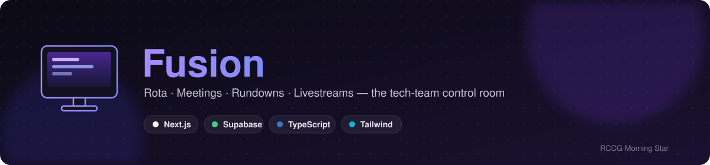
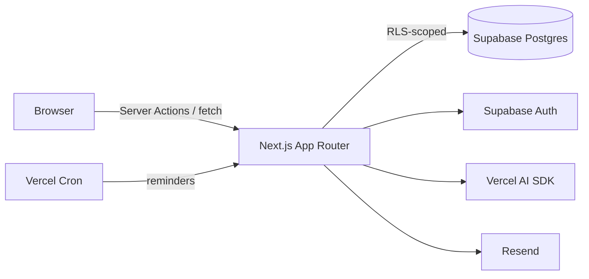

<p align="center">
  
</p>

<p align="center">
  
  
  
  
  
</p>

Rotas, rundowns, livestreams, meetings — one app instead of five spreadsheets and a group chat. Built with Next.js 16, Supabase, and the Vercel AI SDK.

## Table of Contents

- [Features](#features)
- [Quick Start](#quick-start)
- [OBS Integration](#obs-integration)
- [Architecture](#architecture)
- [Development](#development)
- [Database Migrations](#database-migrations)
- [Troubleshooting](#troubleshooting)
- [Resources](#resources)

## Features

| Module | Description |
|--------|-------------|
| 📅 **Rota** | Weekly service scheduling, availability tracking, and duty swaps |
| 🗓️ **Meetings** | Zoom/Google Meet/Teams/in-person meetings — RSVPs, reminders, calendar sync, and team availability-overlap scheduling |
| 🌐 **Public Availability** | A no-sign-in form so anyone on the team can submit availability from a shared link |
| 🎬 **Rundown** | Service order planning with a live operator/display mode |
| 📡 **Livestream** | AI-generated YouTube/Facebook descriptions in a church-announcement format |
| 🎨 **Designs** | Design request tracking, assignment, and file delivery |
| 🎓 **Training** | Training tracks, step-by-step progress, and certificates |
| 📖 **Bible Reader** | AI voice-detection that auto-displays Bible passages on the projection screen — with OBS overlay + dock support |

## Quick Start

### Prerequisites

- Node.js 20+ (LTS recommended)
- pnpm 9+ (`npm install -g pnpm`)
- A [Supabase](https://supabase.com) project

### 1. Clone & Install

```bash
git clone https://github.com/oracleot/rccgms-cybertech.git
cd rccgms-cybertech
pnpm install
```

### 2. Environment Setup

```bash
cp .env.example .env.local
```

Edit `.env.local` with your credentials:

```bash
# Supabase (required)
NEXT_PUBLIC_SUPABASE_URL=https://your-project.supabase.co
NEXT_PUBLIC_SUPABASE_ANON_KEY=your-anon-key
SUPABASE_SERVICE_ROLE_KEY=your-service-role-key

# OpenAI - for AI features (optional for dev)
OPENAI_API_KEY=sk-...

# Resend - for email notifications (optional for dev)
RESEND_API_KEY=re_...
RESEND_FROM_EMAIL=notifications@yourdomain.com

# App URL
NEXT_PUBLIC_APP_URL=http://localhost:3000
```

### 3. Database Setup

```bash
# One-off CLI use (no global install needed)
pnpm dlx supabase link --project-ref your-project-ref

# Push migrations
pnpm dlx supabase db push
```

### 4. Run Development Server

```bash
pnpm dev
```

Open [http://localhost:3000](http://localhost:3000)

---

---

## OBS Integration

Two URL-based OBS integrations — a display source and a control dock. No plugin installation. OBS loads them as web pages in its built-in Chromium browser, and they update in real time via Supabase Realtime.

> **How it works:** When the operator sends a passage from the Bible Reader or the OBS dock, it is broadcast over a Supabase Realtime channel. The display source receives it and puts the verse on stream instantly. No WebSocket server to run, no `.dll` to install. The channel is namespaced by domain, so a developer running the app locally can never broadcast onto the church's stream — keep the Bible Reader, dock and display source on the same domain.

### 1. Bible Display (Browser Source)

Behaves like a native OBS text source: **transparent**, showing only the reference and the verse text over whatever your scene already has — church branding, an open-Bible image, a live camera. It fills whatever size you give the source and sizes the type to match, so you can run it at OBS's default 800×600, at 400×500 like the FirstFruits plugin, or full-frame at 1920×1080, then scale and position it in the scene like any other source.

**OBS Setup:**

1. In your Bible scene, click **+** → **Browser Source**, placed above your background
2. Set the URL:
   ```
   https://rccgms-cybertech.vercel.app/bible/obs
   ```
3. Leave OBS's defaults — size (800×600) and Custom CSS are both fine. Resize the source in the scene to taste
4. Check **Shutdown source when not visible**

To position the source before anyone has sent a verse, add `?preview=1` to the URL temporarily — it shows a sample verse without connecting. Remove it when done.

`/bible/obs/scene` still works and shows the same thing, so existing setups keep running.

#### Appearance settings

Click the **gear icon** at the bottom of the OBS dock to open **Scene Appearance**. Changes apply to the display instantly — no URL editing, no reloading the source.

| Setting | What it does |
|---------|--------------|
| **Style** | **Text only** (default) or **Lower-third card** — the purple band with the reference and quoted verse |
| **Background** | Colour picker plus an opacity slider. **0% is fully transparent**; raise it to dim a busy background behind the text. Covers the whole source, not just the text |
| **Text position** | Top, Centre or Bottom of the source |
| **Text size** | 50–150%, relative to the source width. Drop below 100% for long passages |
| **Reference** | Above the text, below it, or hidden |
| **Font** | Serif or Sans |
| **Text colour** / **Reference colour** | Colour pickers |
| **Drop shadow** | Keeps text legible over video — turn off over a plain background |
| **Show translation** | The `(KJV)` suffix on the reference |
| **Inline verse number** | Puts the verse number in front of the text as a superscript — `³ And God said, Let there be light` — the way a printed Bible sets it |
| **Reset to defaults** | Back to text only, transparent, centred, serif |

Settings are remembered by the display itself, so a source that restarts comes back looking the same. To preset the look without opening the dock, URL parameters still work and win on first load: `?style=card&bg=000000cc&pos=bottom&size=0.8&ref=hide&font=sans&color=ffffff&accent=ffd700&shadow=0&translation=0&inline=1`.

### 2. Control Dock (Custom Browser Dock)

A compact control panel that lives **inside OBS** — send passages and navigate verses without switching windows.

**OBS Setup:**

1. In OBS, go to **View → Docks → Custom Browser Docks**
2. Enter:
   - **Dock Name:** `Bible Control`
   - **URL:**
     ```
     https://rccgms-cybertech.vercel.app/bible/obs/dock
     ```
3. Click **Apply**
4. The dock appears as a panel — drag it to wherever suits your OBS layout

**Dock features:**
- **Send Reference** — type any reference (`John 3:16`, `Psalm 23`, `Genesis 1:1-5`) and hit Enter
- **Translation** — switch between KJV, WEB, ASV, BBE, YLT without leaving OBS
- **Verse list** — the full passage, one verse per row (see below)
- **Clear Screen** — hide the overlay (appears only when something is live)
- **Toolbar** — the book and gear icons at the bottom switch between the Bible controls and **Scene Appearance**

### Verse Navigation

Loading a multi-verse passage fills the dock with the whole passage, one verse per row, labelled by chapter and verse:

```
GENESIS 1:1-5                             [ ← ] [ → ]
┌──────────────────────────────────────────────────┐
│ 1:1   In the beginning God created the heaven    │
│       and the earth.                             │
│                                                  │
│ 1:2   And the earth was without form, and void;  │  ← live
│       and darkness was upon the face of the deep │
│                                                  │
│ 1:3   And God said, Let there be light: and      │
│       there was light.                           │
└──────────────────────────────────────────────────┘
```

- **Click any verse** to put just that verse on screen
- **← / →** step to the previous or next verse; arrow keys work too
- The live verse is highlighted and the list auto-scrolls to keep it in view
- The on-screen reference narrows to the verse being shown — `Genesis 1:1-5` becomes `Genesis 1:2`
- Every surface stays in sync: send from the Bible Reader or the dock, and the scene, lower third and projection screen all follow

The same verse list appears in the Bible Reader at `/bible`, so an operator on a laptop and an operator inside OBS see and control the same thing.

### Switching scenes mid-reading

With **Shutdown source when not visible** ticked, OBS stops the browser source every time you leave the scene. When you switch back, the source asks the dock what is currently live and restores that verse and appearance immediately — so moving between the Bible scene and a camera mid-reading does not blank the verse. The dock must be open in OBS for this to work.

### Why not a traditional OBS plugin?

Traditional OBS plugins are compiled C++ `.dll` / `.so` files. This integration uses OBS's built-in **Browser Source** feature instead — which is the standard, recommended way to add web-powered overlays. The advantages are:

| | Browser Source (this) | C++ Plugin |
|---|---|---|
| Installation | None — just a URL | Download + copy `.dll` to OBS folder |
| Updates | Automatic with every Vercel deploy | Manual reinstall |
| OBS version | Works on any OBS version with Browser Source | Must match OBS version |
| Cross-platform | Windows, Mac, Linux | Separate build per platform |

### Bible Reader (in-app)

The full Bible Reader at `/bible` also has voice detection — the mic auto-starts when the page opens in Chrome or Edge. As the pastor speaks, AI detects Bible references and offers to send them to the screen (and the OBS overlay simultaneously).

---

## Architecture

### Tech Stack

- **Framework**: Next.js 16 (App Router, Turbopack)
- **Database**: Supabase (PostgreSQL + Auth + Row-Level Security)
- **Styling**: Tailwind CSS v4 + shadcn/ui
- **AI**: Vercel AI SDK + OpenAI
- **Email**: React Email + Resend
- **Calendar**: Hand-rolled RFC 5545 ICS generation + Google Calendar (optional)
- **Validation**: Zod + React Hook Form

### How a request flows



### Project Structure

```
app/
├── (auth)/              # Public auth pages (login, accept-invite, etc.)
├── (dashboard)/         # Protected routes
│   ├── admin/           # Admin-only pages
│   ├── rota/            # Rota + availability + swaps
│   ├── meetings/        # Meetings, RSVPs, calendar sync
│   ├── rundown/         # Service rundowns + live operator view
│   ├── designs/         # Design request tracking
│   └── training/        # Training tracks
├── availability/        # Public (signed-out) availability form
├── bible/
│   └── obs/             # OBS integrations (public, no auth)
│       ├── page.tsx     # Bible display — load as OBS Browser Source
│       ├── scene/       # Same display under its original URL
│       └── dock/
│           └── page.tsx # Control dock — load as OBS Custom Browser Dock
└── api/                 # API routes + cron jobs

components/
├── ui/                  # shadcn/ui components
├── {feature}/           # Feature-specific components
└── shared/              # Shared components

lib/
├── supabase/            # Supabase clients (client, server, admin)
├── calendar/            # Provider-agnostic ICS/timezone/calendar-links
├── meetings/            # Meeting queries, availability overlap
├── validations/         # Zod schemas
└── notifications/       # Email/SMS services

types/                   # TypeScript types
emails/                  # React Email templates
supabase/migrations/     # Database migrations
specs/                   # Project specifications
```

### User Roles

| Role | Permissions |
|------|-------------|
| **Admin** | Full access, user management, system settings |
| **Lead Developer** | Content/data management across all modules, developer tools |
| **Developer** | Content/data management across all modules |
| **Leader** | Create/edit rotas & meetings, approve swaps, manage team |
| **Member** | View schedules, submit availability, request swaps, RSVP to meetings |

---

## Development

### Common Commands

```bash
pnpm dev                              # Start dev server
pnpm build                            # Production build
pnpm lint                             # Run ESLint
pnpm dlx shadcn@latest add [name]     # Add a shadcn/ui component
```

### Database Commands

All run via `pnpm dlx supabase` — no global CLI install required.

```bash
pnpm dlx supabase db push                                          # Apply migrations
pnpm dlx supabase migration list                                   # Check migration status
pnpm dlx supabase migration new [name]                             # Create a new migration
pnpm dlx supabase gen types typescript --linked > types/database.ts  # Regenerate types
```

### Key Conventions

**File Naming**: lowercase-kebab-case — `rota-calendar.tsx`, `meeting-form.tsx`

**Supabase Clients**:
```typescript
// Server Components & API Routes
import { createClient } from "@/lib/supabase/server"
const supabase = await createClient()

// Client Components
import { createClient } from "@/lib/supabase/client"
const supabase = createClient()

// Admin operations (bypass RLS)
import { createAdminClient } from "@/lib/supabase/admin"
```

**Form Validation**:
```typescript
// Define schema in lib/validations/{feature}.ts
import { z } from "zod"
export const createRotaSchema = z.object({
  serviceId: z.string().uuid(),
  date: z.string().date(),
})

// Use in React Hook Form
import { zodResolver } from "@hookform/resolvers/zod"
const form = useForm({ resolver: zodResolver(createRotaSchema) })
```

---

## Database Migrations

### Creating Migrations

```bash
# 1. Check current migration status
pnpm dlx supabase migration list

# 2. Find the next available number
ls supabase/migrations/

# 3. Create with the next sequential number (e.g., 042_your_migration.sql)
pnpm dlx supabase migration new your_migration_name
```

### Important Rules

- Use sequential 3-digit prefixes: `001_`, `002_`, `003_`
- **Never reuse or duplicate a prefix number**
- Never edit an already-applied migration — create a new one instead
- Run `pnpm dlx supabase migration list` before pushing, to confirm what's actually pending on the target project

---

## Troubleshooting

| Issue | Solution |
|-------|----------|
| "Invalid API key" | Check `.env.local` for correct Supabase keys, no trailing whitespace |
| "RLS policy violation" | Check the user's role in the `profiles` table |
| Type errors after DB changes | Run `pnpm dlx supabase gen types typescript --linked > types/database.ts` |
| Notifications not sending | Check that `RESEND_API_KEY` is set; view `/admin/notifications` for errors |
| Local migration list doesn't match remote | Run `pnpm dlx supabase migration list` — if a migration was applied outside the CLI, use `migration repair --status applied <version>` rather than re-running it |

---

## Resources

- [Product Spec](.github/docs/PRODUCT_SPEC.md) · [Tech Docs](.github/docs/TECH_DOCS.md) · [User Guide](.github/docs/user.guide.md)
- [Project Specs](specs/001-cyber-tech-app-build/) — detailed requirements and API contracts
- [Next.js Docs](https://nextjs.org/docs)
- [Supabase Docs](https://supabase.com/docs)
- [shadcn/ui](https://ui.shadcn.com)
- [Vercel AI SDK](https://sdk.vercel.ai/docs)

<p align="center">— built for the RCCG Morning Star tech team —</p>
